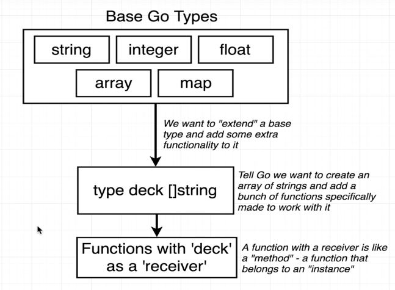

1. Golang is a statically typed language.
```var card string = "abcd"```
2. Basic data types in Golang
    1. bool = true/false
    2. string = "hi!"
    3. int = 0, -10000, 99999
    4. float64 = 10.00001, -100.03
3. Use ```:=``` operator while variable initialization and assignment to tell Go compiler to infer the type. Do not use this operator for variable re-assignment, for that ```=``` operator will work.
```card := "ace of spades"```
4. We can initialize a variable outside a function, we just can't assign a value to it.
    ```
    package main

    import "fmt"

    var deckSize int

    func main(){
        deckSize = 52
        fmt.Println(deckSize)
    }
    ```
5.  ```
    func newCard() string {}
    ```
    Defines a function called 'newCard'. When executed, this function will return a value of type 'string'. Every function that returns a value must indicate what type of value it is returning.

6. Files in the same package can freely call functions defined in other files.

    In main.go
    ```
    package main
        
    func main() {
        printState()
    }
    ```
    In state.go
    ```
    package main
        
    import "fmt"
        
    func printState() {
        fmt.Println("California")
    }
    ```
    To run the code use command ```go run main.go state.go```

7. Array = Fixed length list of things.

8. Slice = An array that can grow or shrink.

9. For Arrays and Slices, every element must be of the same type

10. ``` 
    for index, card :=  range cards {
        fmt.Println(card)
    }
    ```
    1. index = index of this element in the array.
    2. card = Current card we are iterating over.
    3. range cards = Take the slice of cards and loop over it.

11. Iterate over a slice
    ```
    colors := []string {"red", "yellow", "blue"}
    for index, color := range colors {
        fmt.Println(index, color)
    }
    ```

12. Every variable we declare must be used in our code. In the below case 'index' is not being used.
    ```
    for index, card := range cards {
        fmt.Println(card)
    }
    ```

13. Golang is not a Object oriented programming language, so there is no concept of Classes in Golang.

    

14. Recievers and Functions
    ```
    package main
    import "fmt"
    type book string

    func (b book) printTitle() {
        fmt.Println(b)
    }

    func main() {
        var b book = "Harry Potter"
        b.printTitle()
    }
    ```
    The above code output: Harry Potter

15. Golang has support to return multiple values from a function
    ```
    package main
     
    import "fmt"
     
    func main() {
        color1, color2, color3 := colors()
     
        fmt.Println(color1, color2, color3)
    }
     
    func colors() (string, string, string) {
        return "red", "yellow", "blue"
    }
    ```
    Output: red yelloe blue

16. What will the following program output?
    ```
    package main
     
    import "fmt"
     
    func main() {
       c := color("Red")
     
       fmt.Println(c.describe("is an awesome color"))
    }
     
    type color string
     
    func (c color) describe(description string) (string) {
       return string(c) + " " + description
    }
    ```
    Output: "Red is an awesome color"
    'describe' is a function with receiver of type 'color' that requires an argument of type 'string', then return a value of type 'string'.

17. ioutil package
    1. ```func WriteFile(filename string, data []byte, perm os.FileMode) error```
    2. ```data []byte``` is a byte slice.
    3. What is a byte slice? - represents a string in ascii
    4. string = "Hi there!" => byte slice = [72 105 32 116 104 101 114 101 33]

18. Type Conversion in Golang
    1. []byte("Hi there!")

19. Golang Tests
    1. Create a go.mod file
    2. To create run following command in project directory ```go mod init cards```
    3. We can now use the run test function from within VS Code, and/or run the ```go test``` from the terminal.

20. Golang testing is not like RSpec, mocha, jasmine, selenium, etc!
    1. To make a test, create a new file ending in _test.go
    2. To run all tests in a package, run the command ```go test```

